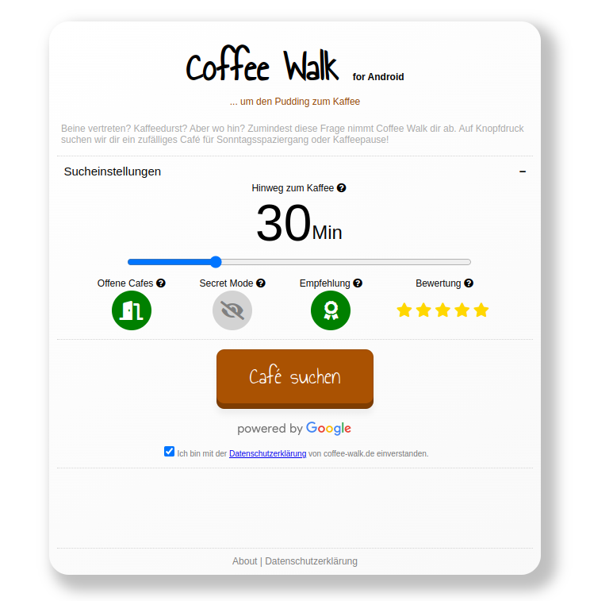
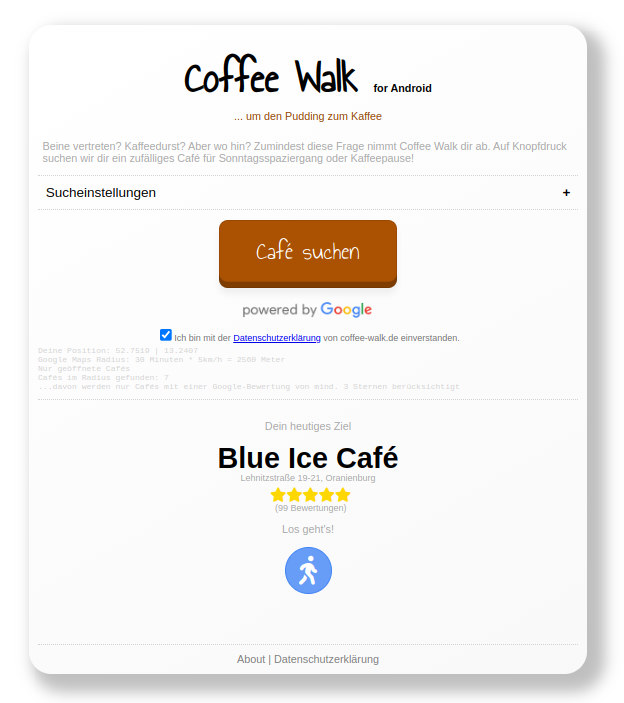

# Coffee Walk

During the COVID pandemic one of the few possible activities left was to take walks and occasionally grab a take-away coffee. To explore some new neighborhoods and coffee places I came up with the idea Coffee Walk. Based on the users location and some parameters this small web-app suggests the user a nice cafe in - hopefully - walking distance.

## Preview

  
  

Solarized dark             |  Solarized Ocean
:-------------------------:|:-------------------------:
  |  

## How it works

The web app is currently hosted on GitHub pages. It runs on **HTML**, **CSS** and **JavaScript**. Users can adjust the search through five input parameters:

1. Distance: Approximately how many minutes should the walk to the cafe take (calculated as the crow flies)?
2. Open: Should the cafe be open or not?
3. Secret mode: If secret mode is activated the user is only navigated to the cafe but is not shown the name.
4. Suggestion: If suggestions is activated only cafes suggested by Coffee Walk are shown as results.
5. Rating: User can define the minimum Google stars rating for the cafes in the result.

The app takes this 5 parameters, combines them with the users location and queries the **Google Places API**. If there is more than one result matching the users input a random cafe is drawn from the results. By hitting the navigation button, the app than gives the user the Google Maps pedestrian navigation to the cafe.
